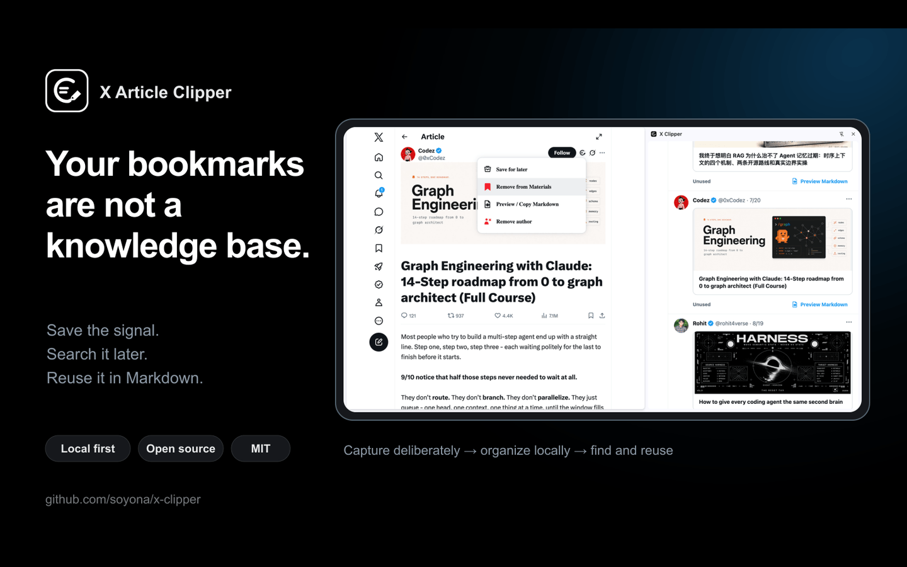
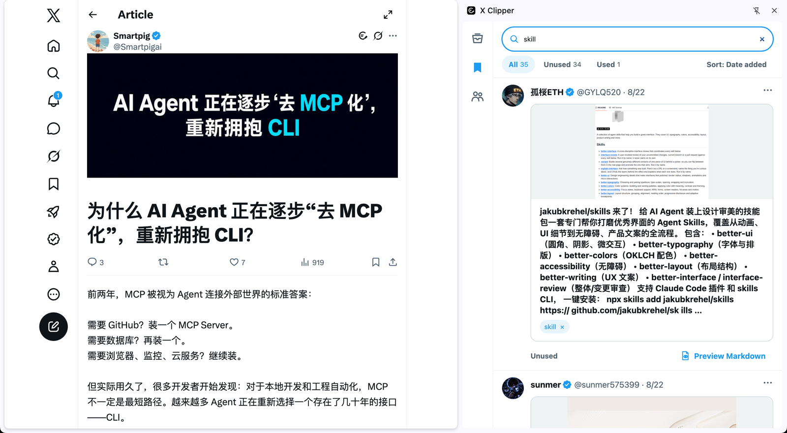
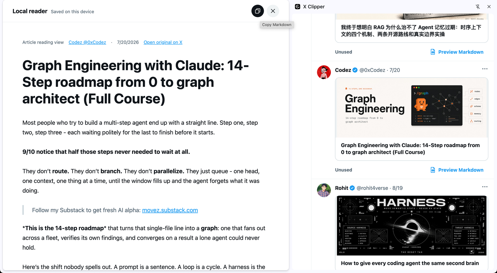

# X Article Clipper

**别让 X 收藏夹成为好内容的坟场。把真正值得保留的 Post 和 Article，变成可检索、可复用、保存在本地的个人知识库。**

[English](README.md) · [简体中文](README.zh-CN.md)

X 是发现 AI 前沿观点、工程经验和创作者洞察的重要信息源。真正困难的往往不是找到好内容，而是在它能够帮助工作时重新找到它。

X Article Clipper 帮你保留已经筛选出的精华：主动保存一份本地快照，在合适的时间集中阅读，用标签整理可复用素材，再通过 Markdown 进入研究或创作流程。



[**下载最新版本**](https://github.com/soyona/x-clipper/releases/latest/download/x-article-clipper.zip) · [安装与升级指南](release/INSTALL.md) · [报告问题](https://github.com/soyona/x-clipper/issues/new?template=bug.yml)

## 安装前需要知道

- X Article Clipper 目前需要通过 Chrome 开发者模式手动安装，尚未发布到 Chrome Web Store。
- 它**不会**批量导入或重新整理已有的 X Bookmarks；采集从 Post 或 Article 详情页开始。
- 你需要能够在自己的网络环境中正常访问和使用 X；插件不提供 X 账号或网络访问服务。

## 快速开始

1. [下载最新安装包](https://github.com/soyona/x-clipper/releases/latest/download/x-article-clipper.zip)并解压。
2. 在 Chrome 打开 `chrome://extensions`，开启“开发者模式”。
3. 点击“加载已解压的扩展程序”，选择 `x-article-clipper` 文件夹。
4. 打开 X Post 或 Article 详情页，点击 Grok/Summarize 左侧的  **X Clipper** 入口。
5. 打开插件 Side Panel，管理待读、素材库和作者。

插件没有构建步骤，也没有第三方运行时依赖。

## 为什么需要 X Article Clipper

- **真正找回重要内容：**按正文和作者检索，不再反复翻找不断增长的收藏列表。
- **建立自己的知识上下文：**通过标签以及独立的阅读、素材状态，围绕真实工作整理内容。
- **保留可靠的本地快照：**原文修改或删除后，已经保存的正文和图片仍可在本地阅读。
- **让输入服务于输出：**需要研究、写作或发布时，把有价值的素材转换为 Markdown。
- **让知识资产属于自己：**正文和图片保存在浏览器本地 IndexedDB，并支持 JSON 备份与恢复。

## 适合谁

- 在 X 跟踪 AI 研究与工程实践的从业者。
- 收集产品、技术和增长经验的 Solo Developer。
- 建立个人知识库的研究者和终身学习者。
- 将高质量信息转化为原创内容的写作者与创作者。

## 核心工作流

```text
发现值得保存的 Post 或 Article
              ↓
           加入待读
              ↓
         阅读本地完整快照
              ↓
       保存为素材并添加标签
              ↓
         检索、复用、标记已使用
```

Post 和 Article 共用一个本地内容库。阅读状态与素材状态相互独立：读完的内容不必成为素材，有价值的素材也可以在很久以后继续复用。

## 看见完整工作流

### 按标签找回已经保存的内容

个人资料库的价值不在于保存多少，而在于不需要逐条翻找，也能再次找到真正需要的内容。



### 本地精读，并通过 Markdown 进入创作流程

在无干扰的本地快照中重新阅读；当内容真正有用时，再复制为 Markdown 用于研究或创作。



## 从发现到复用

| 你的目标 | 采取的动作 | 最终保留什么 |
|---|---|---|
| 稍后集中阅读 | 从当前 Post 或 Article 详情页主动保存 | 可检索的本地快照和独立阅读状态 |
| 建立素材库 | 把有价值的内容保存为素材并添加标签 | 围绕真实工作整理的可复用上下文 |
| 把研究转化为输出 | 预览并复制干净的 Markdown | 可进入笔记、写作或发布流程的素材 |
| 持续关注高质量信息源 | 保存 Article 作者 | 值得再次访问的精选作者列表 |
| 保护自己的资料库 | 导出 JSON 备份，并在恢复时合并 | 由用户掌控的内容、作者、标签和图片副本 |

界面支持英文和简体中文。

## 隐私与数据所有权

- 不需要 X API、API Key 或额外账号。
- 不包含分析统计、跟踪脚本、远程代码或开发者运营的内容服务器。
- 只有用户在支持的页面主动执行 X Article Clipper 动作时，插件才处理页面内容。
- 已保存内容默认只存在于当前浏览器配置，除非用户主动导出备份。
- X Article Clipper 完全开源，并采用 MIT 许可证。

完整说明请阅读[隐私政策](PRIVACY.zh-CN.md)。X Article Clipper 是独立项目，与 X Corp. 没有关联，也未获得其认可或赞助。

## 升级已经安装的开发者模式版本

保护本地数据之前，不要删除现有扩展。

1. 在作者页面导出完整 JSON 备份。
2. 保持现有扩展文件夹的位置不变。
3. 用新版本安装包中的运行文件替换原文件。
4. 打开 `chrome://extensions`，点击 X Article Clipper 的“重新加载”。
5. 确认待读、素材库和作者数据仍然存在。

替换文件前请阅读完整的[安装与升级指南](release/INSTALL.md)。

## 当前边界

X Article Clipper 优先解决“人工筛选后的精华如何沉淀”，而不是追求批量采集。

- 当前不会导入或重新整理已有的 X Bookmarks 历史。
- Home、历史和作者列表 Card 均不注入入口；请先打开 Post 或 Article 详情页。
- Post 只保存当前作者的当前正文及所属图片，不保存引用 Post、回复、评论或完整 Thread。
- 不下载视频和音频文件；已保存内容可以返回 X 播放原媒体。
- 数据默认只存在于当前浏览器配置，需要跨设备时请手动备份和恢复。
- X Web 结构可能变化；兼容性问题应提供可复现且不含隐私信息的最小证据。

## 反馈与贡献

如果这种工作流符合你在 X 上学习或创作的方式，Star 可以帮助更多有同样痛点的人发现项目。

- [报告问题](https://github.com/soyona/x-clipper/issues/new?template=bug.yml)
- [提出改进建议](https://github.com/soyona/x-clipper/issues/new?template=feature.yml)
- 提交 Pull Request 前请阅读 [CONTRIBUTING.md](CONTRIBUTING.md)。

Issue 中请勿包含 Cookie、认证令牌、私信、私密账号内容或完整 X 页面 DOM。

## 开发

```bash
npm test
```

`manifest.json` 是 Chrome 入口；`content.js` 负责用户主动触发的页面采集，`content-db.js` 负责本地 IndexedDB 持久化，`markdown.js` 负责稳定的 Markdown 输出。

## 许可证

[MIT](LICENSE) © 2026 soyona 及贡献者。
