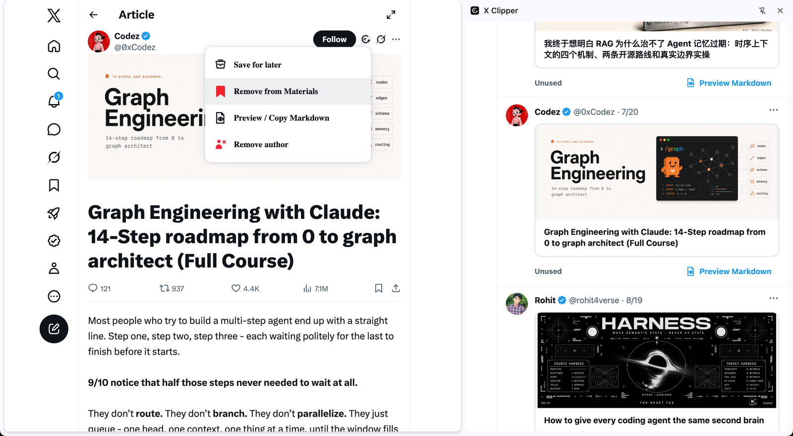

# X Article Clipper

**把 X 上值得保存的 Post 和 Article，变成可检索、可复用、保存在本地的个人知识库。**

[English](README.md) · [简体中文](README.zh-CN.md)

X 是发现 AI 前沿观点、工程经验和创作者洞察的重要信息源。但只有能够再次找回并真正复用的收藏，才会成为知识资产。

X Article Clipper 帮你保存已经筛选出的精华：在碎片时间留下完整快照，在合适的时间集中阅读，用标签整理可复用素材，再通过 Markdown 进入研究或创作流程。

> 收藏不等于知识库。能够找回和复用，才是收藏的真正价值。



## 为什么需要 X Article Clipper

- **真正找回重要内容：**按正文和作者检索，不再反复翻找不断增长的收藏列表。
- **建立自己的知识上下文：**通过标签以及独立的阅读、素材状态，围绕真实工作整理内容。
- **保留可靠的本地快照：**原文修改或删除后，已经保存的正文和图片仍可在本地阅读。
- **让输入服务于输出：**需要研究、写作或发布时，把有价值的素材转换为 Markdown。
- **让知识资产属于自己：**正文和图片保存在浏览器本地 IndexedDB，并支持 JSON 备份与恢复。

插件不调用 X API，不需要 API Key 或额外账号，也不包含分析统计、跟踪脚本或开发者运营的服务器。

## 适合谁

- 在 X 跟踪 AI 研究与工程实践的从业者。
- 收集产品、技术和增长经验的 Solo Developer。
- 建立个人知识库的研究者和终身学习者。
- 将高质量信息转化为原创内容的写作者与创作者。

## 核心工作流

```text
发现值得保存的 Post 或 Article
              ↓
           加入待读
              ↓
         阅读本地完整快照
              ↓
       保存为素材并添加标签
              ↓
         检索、复用、标记已使用
```

Post 和 Article 共用一个本地内容库。阅读状态与素材状态相互独立：读完的内容不必成为素材，有价值的素材也可以在很久以后继续复用。

## 看见完整工作流

### 按标签找回已经保存的内容

个人资料库的价值不在于保存多少，而在于不需要逐条翻找，也能再次找到真正需要的内容。


### 本地精读，并通过 Markdown 进入创作流程

在无干扰的本地快照中重新阅读；当内容真正有用时，再复制为 Markdown 用于研究或创作。


## 可以完成什么

- 从当前 Post 或 Article 详情页主动保存内容。
- 检索待读与素材库。
- 按阅读、素材状态筛选，并按加入或发布时间排序。
- 为素材添加标签，标记已使用或未使用。
- 在无干扰的本地阅读器中阅读完整快照。
- 预览并复制 Markdown。
- 收藏 Article 作者，方便以后继续发现内容。
- 导出完整本地备份，并合并恢复到另一个浏览器配置。
- 使用英文或简体中文界面。

## 从源码安装

X Article Clipper 目前通过 Chrome 开发者模式手动安装，尚未发布到 Chrome Web Store。

1. [下载 v1.1.1 安装包](https://github.com/soyona/x-clipper/releases/download/v1.1.1/x-article-clipper-v1.1.1.zip)并解压。
2. 在 Chrome 打开 `chrome://extensions`。
3. 开启右上角的“开发者模式”。
4. 点击“加载已解压的扩展程序”，选择解压后的 `x-article-clipper-v1.1.1` 文件夹。
5. 打开一个 X Post 或 Article 详情页，使用 Grok/Summarize 左侧的 X Clipper 入口。
6. 打开插件 Side Panel，管理待读、素材库和作者。

插件没有构建步骤，也没有第三方运行时依赖。

已经安装旧版本的用户，升级前应先导出完整备份，并保留原扩展目录路径。替换文件前请阅读[升级说明](release/INSTALL.md)。

## 当前边界

X Article Clipper 优先解决“人工筛选后的精华如何沉淀”，而不是追求批量采集。

- 当前不会导入或重新整理已有的 X Bookmarks 历史。
- Home、历史和作者列表 Card 均不注入入口；请先打开 Post 或 Article 详情页。
- Post 只保存当前作者的当前正文及所属图片，不保存引用 Post、回复、评论或完整 Thread。
- 不下载视频和音频文件；已保存内容可以返回 X 播放原媒体。
- 数据默认只存在于当前浏览器配置，需要跨设备时请手动备份和恢复。
- X Web 结构可能变化；兼容性问题应提供可复现且不含隐私信息的最小证据。

## 隐私与数据所有权

只有用户在支持的页面主动执行 X Article Clipper 动作时，插件才处理页面内容。已经保存的内容不会上传给开发者或第三方服务。

完整说明请阅读[隐私政策](PRIVACY.zh-CN.md)。X Article Clipper 是独立项目，与 X Corp. 没有关联，也未获得其认可或赞助。

## 反馈与贡献

如果这种工作流符合你在 X 上学习或创作的方式，Star 可以帮助更多有同样痛点的人发现项目。

- [报告问题](https://github.com/soyona/x-clipper/issues/new?template=bug.yml)
- [提出改进建议](https://github.com/soyona/x-clipper/issues/new?template=feature.yml)
- 提交 Pull Request 前请阅读 [CONTRIBUTING.md](CONTRIBUTING.md)。

Issue 中请勿包含 Cookie、认证令牌、私信、私密账号内容或完整 X 页面 DOM。

## 开发

```bash
npm test
```

`manifest.json` 是 Chrome 入口；`content.js` 负责用户主动触发的页面采集，`content-db.js` 负责本地 IndexedDB 持久化，`markdown.js` 负责稳定的 Markdown 输出。

## 许可证

[MIT](LICENSE) © 2026 soyona 及贡献者。
